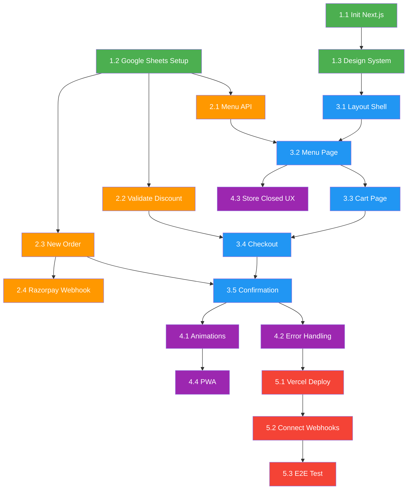

# 🍕 MASTER PLAN: Kitchen Order — Zero-Cost Food Ordering Website

> **Version:** 1.0 (Final)  
> **Created:** 2026-03-27  
> **Status:** Approved — Ready to Build  
> **Philosophy:** "I just expect it to work" — minimal complexity, maximum reliability, zero cost.

---

## Table of Contents

1. [Project Overview](#1-project-overview)
2. [Architecture](#2-architecture)
3. [Cost Breakdown](#3-cost-breakdown)
4. [Google Sheets Schema](#4-google-sheets-schema)
5. [n8n Backend Workflows](#5-n8n-backend-workflows)
6. [Frontend Structure](#6-frontend-structure)
7. [Design System & Theming](#7-design-system--theming)
8. [WhatsApp Integration](#8-whatsapp-integration)
9. [Payment Integration](#9-payment-integration)
10. [Implementation Phases](#10-implementation-phases)
11. [Store Owner Guide](#11-store-owner-guide)
12. [Known Limitations & Future Upgrades](#12-known-limitations--future-upgrades)

---

## 1. Project Overview

### What We're Building

A **mobile-first food ordering website** for a small kitchen/restaurant. Customers browse a menu, add items to cart, apply discount codes, place orders, pay via Razorpay, and confirm on WhatsApp — all for zero monthly cost.

### Key Decisions

| Decision | Choice | Why |
|----------|--------|-----|
| Framework | Next.js 15 (Static Export) | Component reuse + free Vercel hosting, no server needed |
| Backend | n8n webhooks (Hostinger VPS) | Already hosted, zero cost, visual workflow builder |
| Database | Google Sheets (4 tabs) | Staff edits directly, free, built-in dashboard |
| Images | Cloudinary free tier | 25GB bandwidth, reliable CDN, free |
| WhatsApp | `wa.me` deep links | Free, customer-initiated, works on normal WhatsApp |
| Payments | Razorpay Payment Links + UPI QR | Auto-verify via webhook + manual fallback |
| Operating Hours | Staff-controlled toggle in Sheets | Y/N cell in Settings tab |
| Add-ons | Mixed (free prefs + paid extras) | JSON in Menu sheet, `price: 0` = free |
| Item Availability | Y/N column in Menu sheet | Staff toggles directly |
| Branding | All from Google Sheets | Colors, fonts, logo, favicon — owner controls everything |
| Expected Volume | ~50 orders/day | Well within free tier limits |

---

## 2. Architecture

```
┌─────────────────────────────────────────────────────────────────┐
│                      SYSTEM ARCHITECTURE                        │
│                                                                 │
│  📱 Customer Phone (Browser)                                    │
│    │                                                            │
│    ▼                                                            │
│  🌐 Next.js Static Site ──── Vercel Free Tier                   │
│    │  • Browse menu (fetched from n8n)                          │
│    │  • Cart in localStorage                                    │
│    │  • Dynamic theme from Google Sheets                        │
│    │                                                            │
│    ▼                    ▲ JSON responses                        │
│  ⚙️ n8n Webhooks ───── Hostinger VPS (your existing server)     │
│    │  • GET  /menu          → Menu + Settings + Branding        │
│    │  • POST /validate      → Discount validation               │
│    │  • POST /order         → Place new order                   │
│    │  • POST /razorpay      → Payment confirmation              │
│    │                                                            │
│    ▼                    ▲ Read/Write via Sheets API              │
│  📊 Google Sheets (4 tabs)                                      │
│    │  • Settings  → Store info + branding                       │
│    │  • Menu      → Items, prices, availability, add-ons        │
│    │  • Orders    → All orders, payment/order status             │
│    │  • Discounts → Active codes, usage tracking                │
│    │                                                            │
│    ├──▶ 💳 Razorpay API → Generate payment links                │
│    │         │                                                  │
│    │         ▼ (webhook on payment success)                     │
│    │     n8n updates Payment Status → "Paid"                    │
│    │                                                            │
│    └──▶ 📱 wa.me Deep Link → Pre-filled WhatsApp message       │
│              │                                                  │
│              ▼                                                  │
│         Kitchen staff's normal WhatsApp                         │
│         (staff replies manually)                                │
└─────────────────────────────────────────────────────────────────┘
```

### Customer Journey (Step by Step)

```
1. Customer opens website on phone
2. Site fetches menu + settings + branding from n8n
3. If store is CLOSED → overlay with closed message, no ordering
4. Customer browses menu (filter by category, veg/non-veg)
5. Taps "Add" → picks add-ons (free prefs + paid extras) → adds to cart
6. Reviews cart → adjusts quantities → sees subtotal
7. Checkout: enters name, phone, address, picks delivery/pickup
8. Applies discount code → validated server-side via n8n
9. Chooses payment: Razorpay (online) or UPI QR (manual)
10. Clicks "Place Order" → n8n creates order in Google Sheets
11. Confirmation page shows:
    - Order ID
    - "Pay Now" button → Razorpay Payment Link
    - "Confirm on WhatsApp" button → wa.me link
12. Customer pays → Razorpay webhook auto-updates Sheets
13. Customer sends WhatsApp → kitchen staff sees order
14. Staff manages orders from Google Sheets dashboard
```

---

## 3. Cost Breakdown

### Monthly Cost: ₹0

| Service | Free Limit | Our Usage (~50 orders/day) | Cost |
|---------|------------|---------------------------|------|
| **Vercel** (frontend hosting) | 100GB bandwidth/mo | ~5GB | ₹0 |
| **Google Sheets API** | 300 req/min | ~200 req/day | ₹0 |
| **Cloudinary** (images) | 25 credits/mo (~25GB) | ~2GB | ₹0 |
| **n8n** (backend) | Self-hosted, unlimited | Already on Hostinger | ₹0 |
| **Razorpay** | No monthly fee | 2% per transaction | 2%* |
| **WhatsApp** (`wa.me` links) | Unlimited | Unlimited | ₹0 |
| **Google Fonts** | Unlimited | 1 font/session | ₹0 |

> *Razorpay 2% is on payment amount (e.g., ₹5 on a ₹250 order). This is standard for all Indian payment gateways and unavoidable.

---

## 4. Google Sheets Schema

### Tab 1: `Settings` (22 rows)

#### Store Info (Rows 1-10)
| Row | A (Label) | B (Value) | Purpose |
|-----|-----------|-----------|---------|
| 1 | Store Name | Your Kitchen | Site title, header |
| 2 | Store Phone | 919876543210 | WhatsApp (country code, no +) |
| 3 | **Store Open** | **Y** | **⭐ Master toggle — Y or N** |
| 4 | Closed Message | We're closed! Back at 10 AM | Shown when Store Open = N |
| 5 | Store Address | 123 Main St, City | Footer, checkout |
| 6 | Delivery Available | Y | Toggle delivery option |
| 7 | Min Order Amount | 150 | Minimum order ₹ |
| 8 | Delivery Fee | 30 | Delivery charge (0 = free) |
| 9 | UPI QR Image URL | https://... | UPI QR for manual payment |
| 10 | Currency Symbol | ₹ | Price display |

#### Branding (Rows 11-22)
| Row | A (Label) | B (Value) | Purpose |
|-----|-----------|-----------|---------|
| 11 | **Primary Color** | #E63946 | Buttons, header, CTAs |
| 12 | **Accent Color** | #457B9D | Links, badges, secondary |
| 13 | Background Color | #FFFFFF | Page background |
| 14 | Surface Color | #F8F9FA | Card/input backgrounds |
| 15 | Text Color | #1D3557 | Main text |
| 16 | **Font** | Inter | Google Font name |
| 17 | **Logo URL** | https://res.cloudinary.com/.../logo.png | Header logo |
| 18 | **Favicon URL** | https://res.cloudinary.com/.../favicon.ico | Browser tab icon |
| 19 | Banner Image URL | *(optional)* | Hero/header banner |
| 20 | Footer Text | © 2026 Your Kitchen. Made with ❤️ | Footer |
| 21 | Instagram URL | *(optional)* | Social link |
| 22 | Google Maps URL | *(optional)* | Location link |

---

### Tab 2: `Menu` (10 columns)

| Col | Header | Type | Example | Notes |
|-----|--------|------|---------|-------|
| A | ID | Number | 1 | Auto (row number) |
| B | Name | Text | Butter Chicken | Item name |
| C | Description | Text | Rich creamy curry... | Short description |
| D | Price | Number | 250 | Base price ₹ |
| E | Category | Text | Main Course | For filtering |
| F | Image URL | URL | https://res.cloudinary.com/... | Cloudinary URL |
| G | **Available** | **Y/N** | **Y** | **⭐ Staff toggles this** |
| H | Add-ons | Text | *(see below)* | Mixed free + paid |
| I | Sort Order | Number | 1 | Display order |
| J | Veg/Non-Veg | Text | Veg | Badge display |

**Add-ons Format (Simple Text):**
Instead of writing complex JSON, just write Name: Price separated by commas.
```text
Extra Cheese: 30, Double Portion: 50, Extra Spicy: 0, No Onions: 0
```
> `price: 0` = free preference | `price: > 0` = paid add-on

---

### Tab 3: `Orders` (18 columns)

| Col | Header | Type | Example |
|-----|--------|------|---------|
| A | Order ID | Text | ORD-1001 |
| B | Timestamp | DateTime | 2026-03-27 10:30:00 |
| C | Customer Name | Text | Rahul |
| D | Phone | Text | 9876543210 |
| E | Items | JSON | `[{"name":"Butter Chicken","qty":2,"price":250,"addons":[...]}]` |
| F | Subtotal | Number | 530 |
| G | Discount Code | Text | WELCOME10 |
| H | Discount Amount | Number | 53 |
| I | Delivery Fee | Number | 30 |
| J | Total | Number | 507 |
| K | Payment Method | Text | Razorpay / UPI QR |
| L | Payment Status | Text | Paid / Pending / Failed |
| M | **Order Status** | Text | New / Confirmed / Preparing / Ready / Delivered |
| N | Delivery Type | Text | Delivery / Pickup |
| O | Address | Text | 123 Main St... |
| P | Notes | Text | Extra spicy please |
| Q | Razorpay Link | URL | https://rzp.io/l/xxx |
| R | WhatsApp Sent | Y/N | Y |

---

### Tab 4: `Discounts` (9 columns)

| Col | Header | Type | Example |
|-----|--------|------|---------|
| A | Code | Text | WELCOME10 |
| B | Type | Text | percent / flat |
| C | Value | Number | 10 |
| D | Min Order | Number | 200 |
| E | Max Discount | Number | 100 |
| F | Active | Y/N | Y |
| G | Expiry | Date | 2026-12-31 |
| H | Usage Limit | Number | 100 |
| I | Used Count | Number | 23 |

---

## 5. n8n Backend Workflows

### Workflow 1: Menu API

```
Trigger:   Webhook GET /menu
Purpose:   Serve menu data + store settings + branding to frontend

Steps:
  1. Read Settings tab → parse all 22 rows into key-value object
  2. Read Menu tab → filter rows where Available = "Y"
  3. Parse add-ons JSON for each menu item
  4. Sort by Sort Order column

Response:
{
  "store": {
    "name": "Your Kitchen",
    "phone": "919876543210",
    "open": true,
    "closedMessage": "We're closed! Back at 10 AM",
    "address": "123 Main St",
    "deliveryAvailable": true,
    "minOrder": 150,
    "deliveryFee": 30,
    "upiQrUrl": "https://...",
    "currency": "₹"
  },
  "branding": {
    "primaryColor": "#E63946",
    "accentColor": "#457B9D",
    "backgroundColor": "#FFFFFF",
    "surfaceColor": "#F8F9FA",
    "textColor": "#1D3557",
    "font": "Inter",
    "logoUrl": "https://...",
    "faviconUrl": "https://...",
    "bannerUrl": "",
    "footerText": "© 2026 Your Kitchen",
    "instagramUrl": "",
    "googleMapsUrl": ""
  },
  "menu": [
    {
      "id": 1,
      "name": "Butter Chicken",
      "description": "Rich creamy curry...",
      "price": 250,
      "category": "Main Course",
      "imageUrl": "https://...",
      "addons": [
        {"name": "Extra Cheese", "price": 30},
        {"name": "Extra Spicy", "price": 0}
      ],
      "type": "Non-Veg"
    }
  ]
}
```

---

### Workflow 2: Validate Discount

```
Trigger:   POST /validate-discount
Body:      { "code": "WELCOME10", "subtotal": 500 }
Purpose:   Server-side discount validation (cannot be bypassed)

Steps:
  1. Read Discounts tab
  2. Find row where Code matches (case-insensitive)
  3. Validate:
     - Active = "Y"
     - Expiry >= today
     - Used Count < Usage Limit
     - Subtotal >= Min Order
  4. Calculate discount:
     - If type = "percent": discount = subtotal × value / 100
     - If type = "flat": discount = value
     - Cap at Max Discount
  5. Return result

Response (success):
{
  "valid": true,
  "type": "percent",
  "value": 10,
  "discountAmount": 50,
  "message": "10% off applied! You save ₹50"
}

Response (failure):
{
  "valid": false,
  "discountAmount": 0,
  "message": "Minimum order of ₹200 required for this code"
}
```

---

### Workflow 3: New Order

```
Trigger:   POST /new-order
Body:      {
             "customer": { "name": "Rahul", "phone": "9876543210" },
             "items": [{ "id": 1, "name": "Butter Chicken", "qty": 2, "price": 250,
                          "addons": [{"name": "Extra Cheese", "price": 30}] }],
             "discountCode": "WELCOME10",
             "deliveryType": "delivery",
             "address": "123 Main St",
             "notes": "Extra spicy",
             "paymentMethod": "razorpay"
           }
Purpose:   Process order, generate payment link, write to Sheets

Steps:
  1. Validate required fields (name, phone, items)
  2. Calculate subtotal (items × qty + addons)
  3. Re-validate discount code server-side (call Workflow 2 logic)
  4. Calculate delivery fee (if delivery + from Settings)
  5. Calculate final total = subtotal - discount + delivery fee
  6. Generate Order ID: ORD-{MMDD}{random4digits}
  7. If paymentMethod = "razorpay":
     → Call Razorpay API: Create Payment Link
     → Get payment link URL
  8. Write order row to Orders tab
  9. If discount used: increment Used Count in Discounts tab
  10. Build wa.me URL with pre-filled order text
  11. Return response

Response:
{
  "success": true,
  "orderId": "ORD-03271234",
  "subtotal": 530,
  "discountAmount": 53,
  "deliveryFee": 30,
  "total": 507,
  "razorpayLink": "https://rzp.io/l/abc123",
  "waLink": "https://wa.me/919876543210?text=...",
  "upiQrUrl": "https://..."
}
```

---

### Workflow 4: Razorpay Payment Webhook

```
Trigger:   POST /razorpay-webhook (called by Razorpay on payment success)
Purpose:   Auto-update payment status in Google Sheets

Steps:
  1. Receive Razorpay webhook payload
  2. Verify webhook signature (Razorpay secret)
  3. Extract payment link ID from payload
  4. Search Orders tab → find row where Razorpay Link matches
  5. Update that row:
     - Payment Status → "Paid"
     - Order Status → "Confirmed"
  6. Return 200 OK

No frontend response needed — this is server-to-server.
```

---

## 6. Frontend Structure

### Project Tree

```
kitchen-order/
├── public/
│   └── images/               ← fallback/static images
├── src/
│   ├── app/
│   │   ├── layout.js         ← root layout, theme loader, font injection
│   │   ├── page.js           ← Menu page (landing)
│   │   ├── cart/
│   │   │   └── page.js       ← Cart review
│   │   ├── checkout/
│   │   │   └── page.js       ← Customer details + discount
│   │   └── confirmation/
│   │       └── page.js       ← Payment + WhatsApp links
│   ├── components/
│   │   ├── Header.jsx        ← logo, store name, cart icon
│   │   ├── MenuCard.jsx      ← item card with add button
│   │   ├── AddOnModal.jsx    ← add-on selector (free/paid)
│   │   ├── CartDrawer.jsx    ← sticky bottom cart summary
│   │   ├── CategoryFilter.jsx ← horizontal category tabs
│   │   ├── DiscountInput.jsx ← code input with validate button
│   │   ├── OrderSummary.jsx  ← price breakdown component
│   │   ├── StoreClosed.jsx   ← full-screen closed overlay
│   │   ├── Footer.jsx        ← dynamic footer with social links
│   │   └── Skeleton.jsx      ← loading placeholder
│   ├── lib/
│   │   ├── api.js            ← n8n webhook calls (fetch wrappers)
│   │   ├── cart.js            ← localStorage cart CRUD
│   │   ├── theme.js           ← apply branding from settings
│   │   └── whatsapp.js        ← wa.me URL builder
│   └── styles/
│       └── globals.css        ← design system (CSS custom properties)
├── next.config.js             ← output: 'export'
└── package.json
```

### Pages

| Page | URL | Purpose | Key Elements |
|------|-----|---------|-------------|
| **Menu** | `/` | Browse & add to cart | Category tabs, veg filter, menu grid, add-on modal, sticky cart bar, store-closed overlay |
| **Cart** | `/cart` | Review cart | Item list, qty controls, remove, subtotal, "Proceed" CTA |
| **Checkout** | `/checkout` | Order details | Name, phone, address, delivery/pickup, discount code, payment method, "Place Order" CTA |
| **Confirmation** | `/confirmation` | Post-order actions | Order ID, "Pay Now" (Razorpay), "Confirm on WhatsApp" (wa.me), order summary |

### Mobile-First UI Layout

#### Menu Page
```
┌─────────────────────────┐
│ [Logo]  Your Kitchen  🛒3│  ← Header
├─────────────────────────┤
│ All | Starters | Mains ▸│  ← Category tabs (scroll)
├─────────────────────────┤
│ [🟢 Veg] [All]          │  ← Veg/Non-veg filter
├─────────────────────────┤
│ ┌───────┐ ┌───────┐     │
│ │ 📷    │ │ 📷    │     │  ← Menu cards (2-col grid)
│ │Butter │ │Paneer │     │
│ │Chicken│ │Tikka  │     │
│ │₹250   │ │₹200   │     │
│ │[Add +]│ │[Add +]│     │
│ └───────┘ └───────┘     │
│ ┌───────┐ ┌───────┐     │
│ │ ...   │ │ ...   │     │
│ └───────┘ └───────┘     │
├─────────────────────────┤
│ 🛒 View Cart (3) — ₹750 │  ← Sticky bottom bar
└─────────────────────────┘
```

#### Add-on Modal (appears on "Add +")
```
┌─────────────────────────┐
│   Butter Chicken         │
│   ₹250                   │
├─────────────────────────┤
│   Extras:                │
│   ☐ Extra Cheese   +₹30 │  ← Paid
│   ☐ Double Portion +₹50 │  ← Paid
│   ☐ Extra Spicy    FREE  │  ← Free
│   ☐ No Onions      FREE  │  ← Free
├─────────────────────────┤
│   Qty:  [−] 1 [+]       │
├─────────────────────────┤
│   [ Add to Cart — ₹280 ]│  ← CTA with live total
└─────────────────────────┘
```

#### Store Closed Overlay
```
┌─────────────────────────┐
│                          │
│        😴                │
│                          │
│   We're currently closed │
│   Orders open at 10 AM   │
│                          │
│   ── Menu visible but ── │
│   ── grayed out below ── │
│                          │
└─────────────────────────┘
```

---

## 7. Design System & Theming

### CSS Custom Properties (All dynamic)

```css
:root {
  /* ⬇️ These defaults are overridden at runtime from Google Sheets */
  --color-primary: #E63946;
  --color-accent: #457B9D;
  --color-bg: #FFFFFF;
  --color-surface: #F8F9FA;
  --color-text: #1D3557;
  --font-family: 'Inter', sans-serif;

  /* Derived (auto-calculated from primary) */
  --color-primary-hover: /* darken 15% */;
  --color-primary-light: /* primary at 10% opacity */;

  /* Fixed (not customizable — design safety) */
  --color-success: #2E7D32;
  --color-error: #D32F2F;
  --color-warning: #F57C00;
  --color-border: #E0E0E0;

  /* Spacing scale */
  --space-xs: 4px;
  --space-sm: 8px;
  --space-md: 16px;
  --space-lg: 24px;
  --space-xl: 32px;
  --space-2xl: 48px;

  /* Radius */
  --radius-sm: 8px;
  --radius-md: 12px;
  --radius-lg: 16px;
  --radius-full: 9999px;

  /* Shadow */
  --shadow-sm: 0 1px 3px rgba(0,0,0,0.08);
  --shadow-md: 0 4px 12px rgba(0,0,0,0.1);
  --shadow-lg: 0 8px 24px rgba(0,0,0,0.12);
}
```

### Theme Engine (`lib/theme.js`)

```
On page load:
  1. Fetch /menu API → get branding object
  2. Apply colors as CSS custom properties on <html>
  3. Load Google Font dynamically via <link> tag
  4. Update <title> with store name
  5. Update favicon with <link rel="icon">
  6. Store branding in sessionStorage (avoid re-fetch on navigation)

Fallbacks:
  - Invalid hex color → use default
  - Missing font → use Inter
  - Missing logo → show store name as text
  - Missing favicon → use browser default
```

### Allowed Fonts

| Font | Vibe | Best For |
|------|------|----------|
| Inter | Clean, modern | Default |
| Poppins | Friendly, rounded | Casual |
| Playfair Display | Elegant serif | Fine dining |
| Roboto | Neutral | Universal |
| Outfit | Contemporary | Trendy |
| Nunito | Soft, warm | Family |
| Montserrat | Bold, geometric | Strong branding |
| Lora | Classic serif | Traditional |
| DM Sans | Minimal | Modern |
| Josefin Sans | Stylish, thin | Café / bakery |

---

## 8. WhatsApp Integration

### Strategy: Free `wa.me` Deep Links

| What It Does | How |
|-------------|-----|
| Customer clicks "Confirm on WhatsApp" | Opens WhatsApp with pre-filled message |
| Kitchen staff sees order on their phone | Normal WhatsApp — no API, no cost |
| Staff confirms order | Reply manually |

### wa.me URL Format

```
https://wa.me/{storePhone}?text={encodedMessage}
```

### Pre-filled Message Template

```
🍕 NEW ORDER #{orderId}

📋 Items:
• Butter Chicken x2 — ₹500
  + Extra Cheese (+₹30)
• Naan x4 — ₹120

💰 Subtotal: ₹650
🎫 Discount (WELCOME10): -₹65
🚚 Delivery: ₹30
📦 Total: ₹615

💳 Payment: Razorpay (link sent)
📍 Delivery to: 123 Main St
📝 Notes: Extra spicy

Sent from YourKitchen.com
```

### What Works & What Doesn't

| ✅ Works | ❌ Doesn't Work |
|----------|------------------|
| Customer sends order to you | Auto-send messages TO customer |
| Pre-filled order details | Automated "order confirmed" message |
| Free, unlimited | Delivery tracking updates via WhatsApp |
| Works on normal WhatsApp | Message if customer doesn't click the button |

**Mitigation:** Show order status on the website (customer checks with Order ID).

---

## 9. Payment Integration

### Dual Payment Support

| Method | Flow | Auto-Verify |
|--------|------|-------------|
| **Razorpay Payment Links** | n8n creates link → customer clicks → pays → webhook → auto-confirm | ✅ Yes |
| **UPI QR Code** | Show QR image (from Settings) → customer scans → pays → tells staff | ❌ Manual |

### Razorpay Setup

```
1. Create Razorpay account (free, no monthly charges)
2. Get API Key + Secret from Razorpay Dashboard
3. In n8n: Use HTTP Request node to call Razorpay API
4. Set up webhook in Razorpay Dashboard → point to n8n webhook URL
5. Razorpay charges 2% per successful transaction (deducted from settlement)
```

### Payment Link API Call (in n8n)

```json
POST https://api.razorpay.com/v1/payment_links
Authorization: Basic {key_id}:{key_secret}

{
  "amount": 50700,          // in paise (₹507 = 50700)
  "currency": "INR",
  "description": "Order #ORD-03271234",
  "customer": {
    "name": "Rahul",
    "contact": "+919876543210"
  },
  "callback_url": "https://yoursite.vercel.app/confirmation?oid=ORD-03271234",
  "callback_method": "get"
}
```

---

## 10. Implementation Phases

### Dependency Graph



### Phase 1: Setup 🟢

| # | Task | Details | Verify |
|---|------|---------|--------|
| 1.1 | Init Next.js | `create-next-app`, `output: 'export'`, folder structure | `npm run build` → `out/` folder |
| 1.2 | Google Sheets | Create 4 tabs with headers, sample data, API setup, service account | Can read sheet via API |
| 1.3 | Design System | `globals.css` with all custom properties, base component styles | Styles render correctly |

### Phase 2: n8n Backend 🟠

| # | Task | Details | Verify |
|---|------|---------|--------|
| 2.1 | Menu API | GET webhook, read Settings + Menu tabs, return JSON | GET returns menu JSON |
| 2.2 | Validate Discount | POST webhook, read Discounts tab, validate & calculate | Valid code returns discount |
| 2.3 | New Order | POST webhook, process order, Razorpay link, write to Sheets | Order in Sheets + link works |
| 2.4 | Razorpay Webhook | POST webhook, verify signature, update payment status | Payment → Sheet updates |

### Phase 3: Frontend 🔵

| # | Task | Details | Verify |
|---|------|---------|--------|
| 3.1 | Layout Shell | Header (dynamic logo), footer, cart icon badge, theme loader | Layout renders on mobile |
| 3.2 | Menu Page | Fetch menu, category tabs, veg filter, cards, add-on modal, cart bar | Items add to cart |
| 3.3 | Cart Page | Item list, qty +/-, remove, subtotal, empty state | Prices recalculate |
| 3.4 | Checkout | Form, delivery/pickup, discount input, payment selector, place order | Order submits |
| 3.5 | Confirmation | Order ID, Pay Now button, WhatsApp button, UPI QR | Both links work |

### Phase 4: Polish 🟣

| # | Task | Details | Verify |
|---|------|---------|--------|
| 4.1 | Animations | Page transitions, cart add effect, skeletons, toasts | Smooth on mobile |
| 4.2 | Error Handling | Network errors, validation, retry, cart persistence | Error states display |
| 4.3 | Store Closed | Overlay when closed, grayed menu, disabled actions | Toggle in Sheets works |
| 4.4 | PWA | manifest.json, installable, offline page | "Add to Home Screen" works |

### Phase 5: Deploy 🔴

| # | Task | Details | Verify |
|---|------|---------|--------|
| 5.1 | Vercel Deploy | GitHub → Vercel, env vars, domain | Site loads on production URL |
| 5.2 | Connect Webhooks | Frontend URLs → production n8n, Razorpay webhook → n8n, CORS | All 4 workflows respond |
| 5.3 | E2E Test | Full order flow: browse → cart → checkout → pay → WhatsApp | Complete end-to-end success |

---

## 11. Store Owner Guide

### 🎨 Changing Theme Colors

1. Open Google Sheets → `Settings` tab
2. Edit `Primary Color` (cell B11) — enter a hex code like `#FF6B35`
3. Site updates within ~5 minutes (next customer page load)

**Find colors:** Go to [Google Color Picker](https://g.co/kgs/colorpicker), pick a color, copy the HEX value.

**Popular combos:**

| Vibe | Primary | Accent | Background |
|------|---------|--------|------------|
| 🔴 Bold | #E63946 | #457B9D | #FFFFFF |
| 🟠 Fast Food | #FF6B35 | #004E89 | #FFF9F0 |
| 🟢 Healthy | #2D6A4F | #B7E4C7 | #F0FFF4 |
| 🟤 Café | #6F4E37 | #D4A373 | #FDF8F0 |
| ⚫ Premium Dark | #1A1A2E | #E94560 | #16213E |

### 🖼️ Changing Logo / Favicon

1. Upload image to [Cloudinary](https://cloudinary.com) (free account)
2. Copy the image URL
3. Paste in Settings → `Logo URL` (B17) or `Favicon URL` (B18)
4. Logo: PNG, transparent background, ~200×60px recommended
5. Favicon: Use [favicon.io](https://favicon.io) to generate from text/image

### 🔤 Changing Font

Type one of these in Settings → `Font` (B16):
`Inter` · `Poppins` · `Playfair Display` · `Roboto` · `Outfit` · `Nunito` · `Montserrat` · `Lora` · `DM Sans` · `Josefin Sans`

### 🍔 Managing Menu

- **Add item:** New row in Menu tab, fill all columns
- **Remove item:** Set Available = `N` (keeps history)
- **Change price:** Edit Price column
- **Add/change image:** Upload to Cloudinary, paste URL in Image URL column
- **Reorder items:** Change Sort Order numbers

### 🏪 Opening/Closing Store

- Set Store Open = `N` → site shows closed message
- Set Store Open = `Y` → site accepts orders

### 🎫 Managing Discounts

- **New code:** Add row in Discounts tab
- **Deactivate:** Set Active = `N`
- **Track usage:** Used Count auto-increments

---

## 12. Known Limitations & Future Upgrades

### Current Limitations

| Limitation | Impact | Acceptable? |
|------------|--------|-------------|
| No auto-messages to customer | Staff must reply manually on WhatsApp | ✅ Yes for 50 orders/day |
| UPI QR payments need manual verification | Staff checks Sheets | ✅ Yes, Razorpay auto-verifies |
| No real-time order tracking | Customer checks website with Order ID | ✅ Fine for v1 |
| Google Sheets 40 concurrent write limit | Unlikely to hit at 50 orders/day | ✅ Safe |
| Theme changes take ~5 min to reflect | Cached by n8n/browser | ✅ Acceptable |
| No user accounts / order history | Customer provides details each time | ✅ Simple is better |

### Future Upgrades (When Revenue Justifies)

| Upgrade | Cost | When |
|---------|------|------|
| WhatsApp Business API (Gupshup/Interakt) | ₹999-2499/mo | 100+ orders/day |
| Firebase/Supabase instead of Sheets | Free tier | 200+ orders/day |
| Customer accounts + order history | Dev time | Customer demand |
| Push notifications | Free (OneSignal) | When PWA is adopted |
| Admin dashboard (web app) | Dev time | When Sheets feels limiting |

---

> **This is the single source of truth for the entire project.**  
> All development follows this plan. Any changes must be reflected here first.  
> Ready to build — start with Phase 1.
